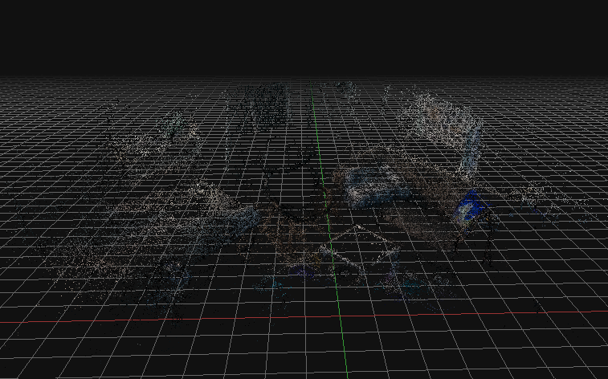
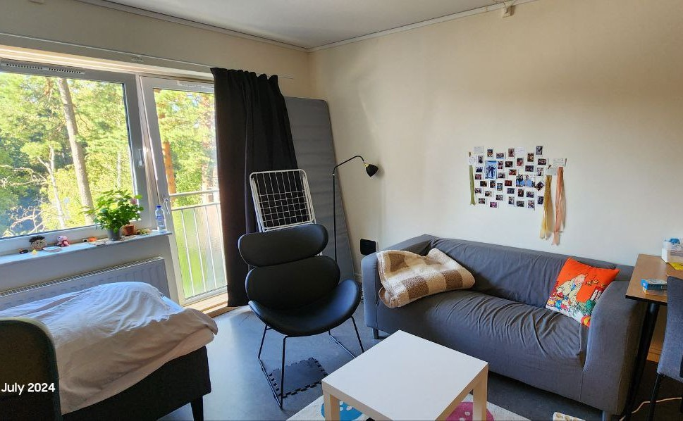

# photogrammtry_3DF-Zephyr
Reconstruct a room in 3D using eDF Zephyr and Tello drone

### Reconstructed room
Only 50 images were utilized to create this 3D point could of my room.

By using free version of `3DF Zephyr` software, only 50 images can be used for reconstrcution.

> Check out [3DF Zephyr](https://www.3dflow.net/) and [its tutorials](https://www.3dflow.net/technology/documents/3df-zephyr-tutorials/)

### Original Scene
This is the scene that was constructed into point coulds. 

### Some Notes:
+ For controlling Tello drone and taking pictures manually, refer [here](https://github.com/SHiTU23/Tello_drone/blob/main/src/control_and_capture.py)
+ Take a deeo look into the picture of [reconstructed room](#reconstructed-room) to find the objects in the [real scene](#original-scene).
+ The more pictures taken from an object, the better and clearer output
+ Creating a 3D model of the point coulds was not satisfying. all objects got merged into one another.